# 📦 OrderFlow API – Gestor de Pedidos

OrderFlow API es una aplicación desarrollada con Django y Django REST Framework que permite administrar **clientes** y **pedidos** de manera sencilla mediante una API REST.  
El proyecto implementa CRUD completo para ambas entidades, así como la relación entre ellas, cumpliendo con los requisitos del laboratorio.

---

## 🛠 Tecnologías Utilizadas
- Python 3.x  
- Django 5.x  
- Django REST Framework  
- SQLite3 (por defecto)  
- Postman / DRF Browsable API para pruebas  

---

## ▶️ Instrucciones para Ejecutar el Proyecto

### 1. Clonar el repositorio  
```bash
git clone <URL-del-repositorio>
cd orderflow_api
```

### 2. Crear y activar un entorno virtual
```bash
python -m venv venv

Windows: 
venv\Scripts\activate
Linux / MacOS: 
source venv/bin/activate
```

### 3. Instalar dependencias
```bash
pip install -r requirements.txt
```

### 4. Aplicar migraciones
```bash
python manage.py migrate
```

### 5. Ejecutar el servidor
```bash
python manage.py runserver
```

El proyecto se ejecutará en:
http://127.0.0.1:8000/

---

## 📚 Endpoints Disponibles

### Entidad Clientes:

#### GET
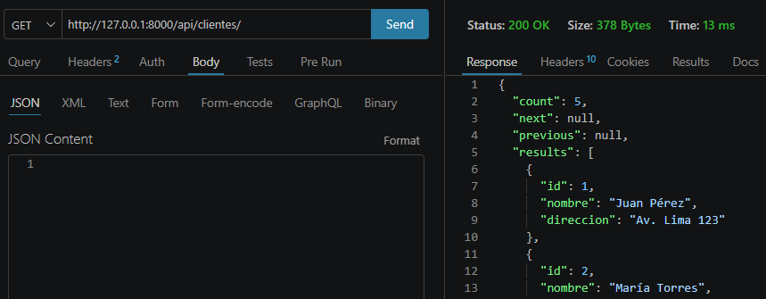

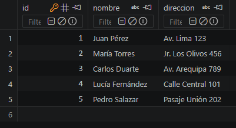

#### POST
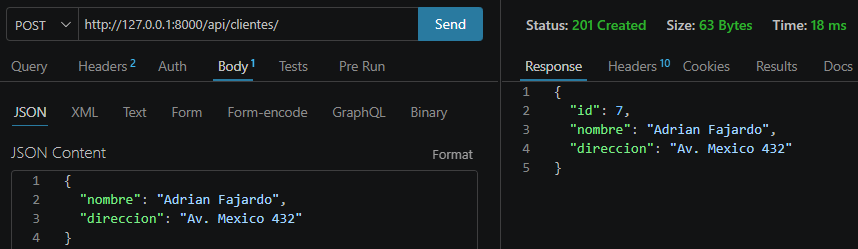

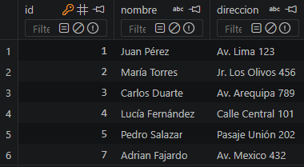

#### PUT
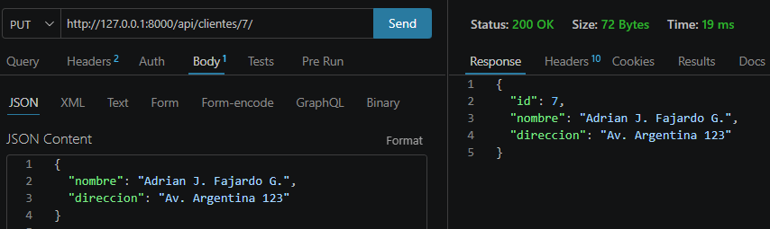

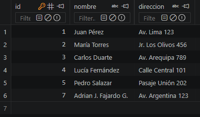

#### DELETE
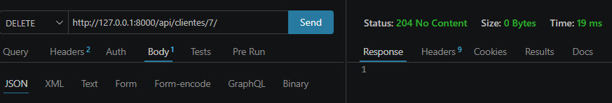

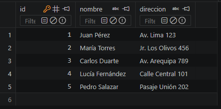


### Entidad Pedidos:

#### GET
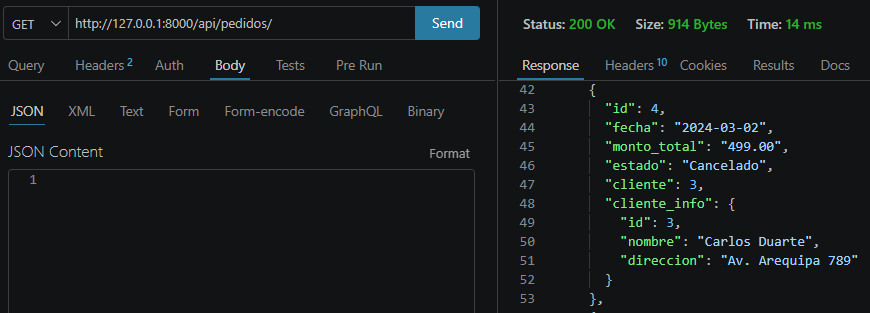

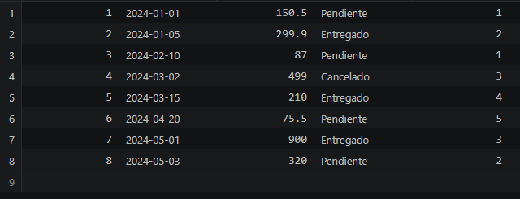

#### POST
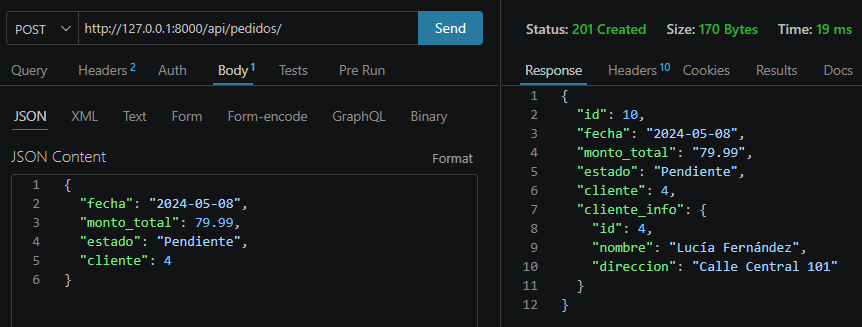

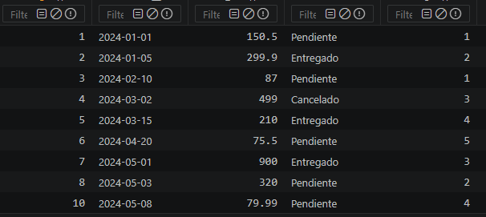

#### PUT
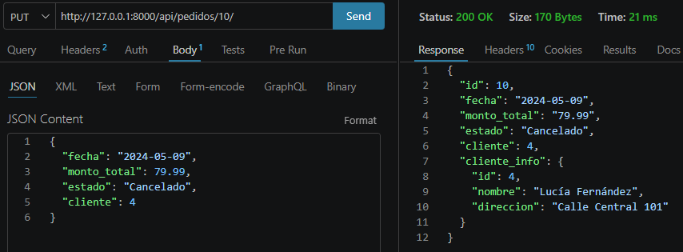

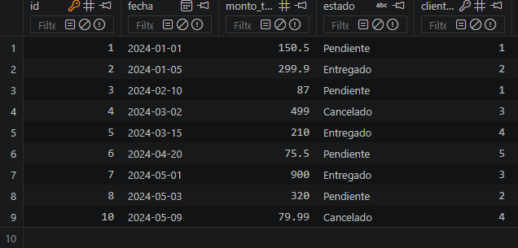

#### DELETE
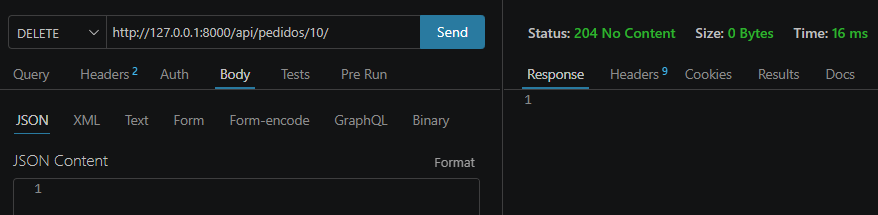

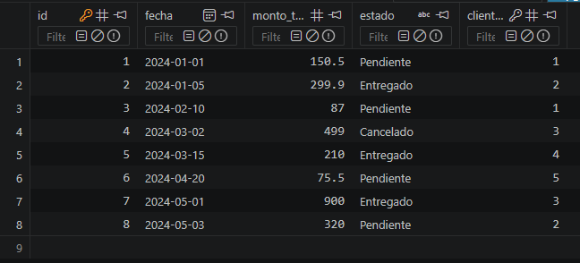


### Entidad Productos:

#### GET
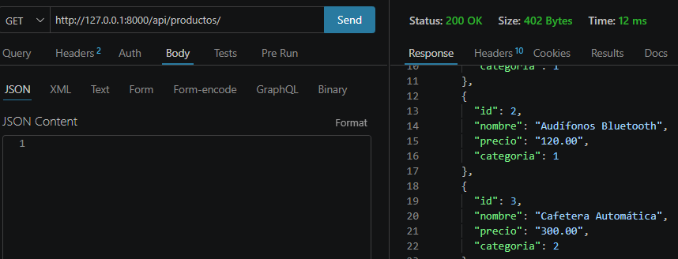

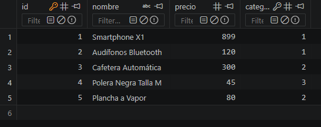

#### POST
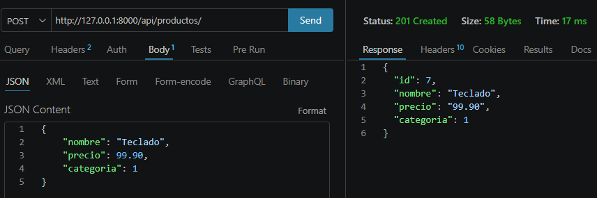

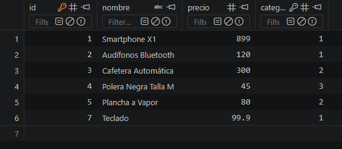

#### PUT
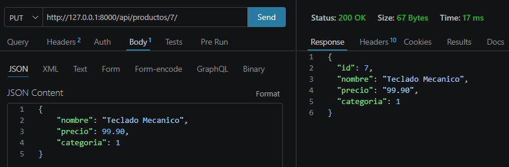

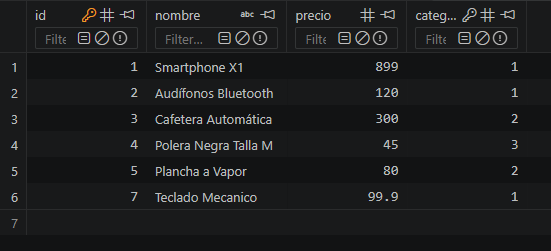

#### DELETE
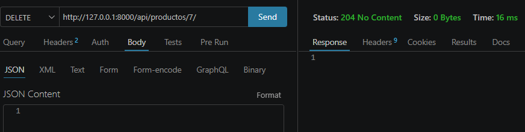

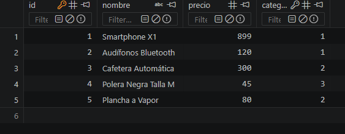

## 📹 Video Explicativo

https://www.youtube.com/watch?v=ZoUKkjPuOwo